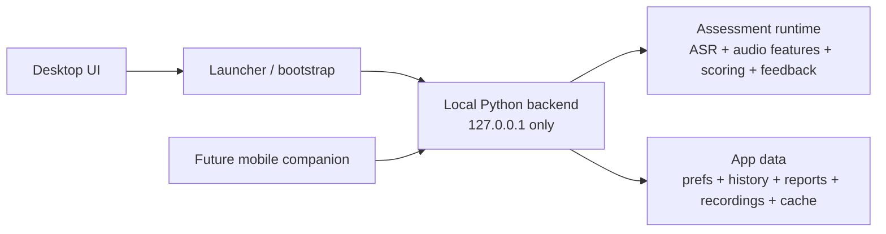
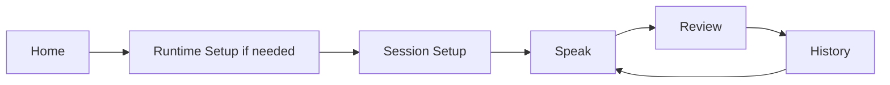
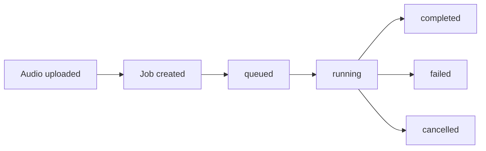

# Local Backend Architecture

Last updated: 2026-04-15
Status: Implemented baseline for the desktop app

## Summary

The app now runs as a desktop-first Streamlit shell backed by a managed local
FastAPI process. The backend runs on `127.0.0.1`, is started or reused by the
launcher, and exposes a small API for diagnostics, runtime status, uploads,
assessments, reports, history, and sample browsing.

This is a product decision, not a hosted-server decision:
1. the user should still feel like they launched one app
2. the backend should not be a separate manual install
3. the same backend contract should be reusable later by an optional mobile
   companion

## Current State

The current shipped architecture is:

1. `app_shell/app_data.py` defines a cross-platform app-data and cache layout
2. `app_shell/bootstrap.py` defines launcher bootstrap behavior
3. `scripts/run_app.py` starts or reuses one healthy local backend per
   app-data root, then launches the UI
4. `app_shell/diagnostics.py` already computes startup diagnostics
5. `app_shell/services.py` and `app_shell/backend_client.py` now consume the
   backend contract by default
6. `assessment_runtime/runner.py` is the shared assessment runner used by both
   the backend and CLI entrypoints
7. learner-facing screens poll backend job state instead of spawning local
   assessment subprocesses
8. shipped EN/IT B1/B2/C1 samples are exposed through the same backend-facing
   sample flow used by the Library screen

## App-Data Policy

The local backend and shell now use OS-native per-user locations by default.

1. macOS uses `~/Library/Application Support/Vostavo` for app data and `~/Library/Caches/Vostavo` for cache data
2. Windows defaults resolve through `platformdirs`, using app author `frommherz_it` and app name `Vostavo`
3. Ubuntu/Linux defaults resolve through `platformdirs` to `~/.local/share/Vostavo` and `~/.cache/Vostavo`, or to `$XDG_DATA_HOME/Vostavo` and `$XDG_CACHE_HOME/Vostavo` when XDG overrides are set
4. legacy `Speaking Studio` env vars and initialized roots remain readable for compatibility
5. repo-local app-data is not a normal default on any platform
6. repo-local app-data remains allowed only through explicit developer overrides such as `VOSTAVO_HOME`, `SPEAKING_STUDIO_HOME`, `--app-data-dir`, or `--cache-dir`

This means generated runtime files such as backend state and root markers now
belong under the resolved app-data root, not under the repository checkout
unless a developer explicitly chooses that mode.

The current storage layout is intentionally unified inside the app-data root:

```text
<app-data-root>/
  backend_state.json
  jobs/
  logs/
  reports/
  recordings/
  uploads/
  tmp/

<cache-root>/
  whisper/
  huggingface/
```

Decisions:
1. keep backend state and logs under the main app-data root for easier support bundles and local debugging
2. keep user-facing outputs under `reports/`
3. keep backend job metadata under `jobs/`, not under `reports/`
4. keep transient processing files under `tmp/`, not under `reports/`
5. migrate legacy `reports/jobs/` into `jobs/` on backend startup when the new job directory is still empty

## Decision

Adopt this process model:



Do not adopt these models now:
1. no hosted multi-user backend
2. no user-managed local server install
3. no frontend-derived backend logic or export hacks

## Goals

1. keep the Python assessment core intact
2. decouple the UI process from long-running assessment work
3. make progress, failure, and cancellation states explicit
4. make desktop packaging easier on macOS, Windows, and Linux
5. create a stable local API that can later support a companion mobile app

## Non-Goals

1. do not add auth, tenancy, or hosted orchestration
2. do not expose the backend on LAN or public interfaces by default
3. do not rewrite the assessment engine in another language
4. do not pick the final desktop framework in this document

## Backend Contract

The backend should expose a deliberately small API surface.

### Health

`GET /v1/health`

Purpose:
1. liveness check for the launcher and desktop shell
2. version and uptime for diagnostics

Example response:

```json
{
  "status": "ready",
  "version": "0.1.0",
  "app_data_root": "/abs/path",
  "uptime_sec": 123
}
```

### Diagnostics

`GET /v1/diagnostics`

Purpose:
1. surface existing startup diagnostics from `app_shell/diagnostics.py`
2. provide learner-facing and support-facing health checks

Example response:

```json
{
  "items": [
    {
      "key": "ffmpeg",
      "status": "ok",
      "title_key": "diagnostics.ffmpeg_title",
      "detail_key": "diagnostics.ffmpeg_ok_detail",
      "detail_args": {"path": "/opt/homebrew/bin/ffmpeg"}
    }
  ]
}
```

### Runtime

`GET /v1/runtime`

Purpose:
1. expose whether runtime setup is complete
2. expose current provider/model state without leaking secrets

Example response:

```json
{
  "configured": true,
  "provider": "openrouter",
  "model": "openai/gpt-4.1-mini",
  "base_url": "https://openrouter.ai/api/v1",
  "requires_api_key": true,
  "has_api_key": true
}
```

### Uploads

`POST /v1/uploads`

Purpose:
1. accept recorded or uploaded audio
2. persist it under app-data
3. return a stable `audio_id`

Notes:
1. desktop can use multipart upload even though it already has direct file
   access
2. using the same upload endpoint keeps desktop and future mobile aligned

Example response:

```json
{
  "audio_id": "aud_123",
  "stored_path": "/abs/path.wav",
  "sha1": "abc123"
}
```

### Assessments

`POST /v1/assessments`

Purpose:
1. create a new assessment job
2. return a stable `assessment_id`

Request shape:

```json
{
  "audio_id": "aud_123",
  "whisper": "small",
  "provider": "openrouter",
  "llm_model": "openai/gpt-4.1-mini",
  "expected_language": "en",
  "feedback_language": "en",
  "speaker_id": "speaker_1",
  "task_family": "monologue",
  "theme": "travel",
  "target_duration_sec": 90,
  "target_cefr": "B2",
  "language_profile_key": "en_b2",
  "label": "practice-2026-04-01",
  "notes": ""
}
```

Response:

```json
{
  "assessment_id": "asmt_123",
  "status": "queued"
}
```

`GET /v1/assessments/{id}`

Purpose:
1. expose job state for desktop polling
2. later expose the same state to a mobile companion

Example running response:

```json
{
  "assessment_id": "asmt_123",
  "status": "running",
  "phase": "transcribing",
  "progress": 0.35,
  "error": null
}
```

Example completed response:

```json
{
  "assessment_id": "asmt_123",
  "status": "completed",
  "phase": "done",
  "progress": 1.0,
  "report_path": "/abs/path/report.json",
  "summary": {
    "score_overall": 78,
    "band": "B2",
    "next_focus": "Use more varied connectors"
  }
}
```

`POST /v1/assessments/{id}/cancel`

Purpose:
1. allow the UI to stop a running job cleanly

### History And Reports

`GET /v1/history`

Purpose:
1. expose lightweight history rows for the History screen
2. reuse the current `history_rows(...)` shape where possible

`GET /v1/history/{session_id}`

Purpose:
1. return the full persisted report payload for review and detail views

### Samples

`GET /v1/samples`

Purpose:
1. expose the shipped CEFR sample matrix
2. let desktop and future mobile surfaces browse the same sample library

## Learner Flow

The current desktop learner path is:



Key behaviors:
1. Home presents local setup as the dominant first-run action
2. Runtime Setup recommends local providers first and tucks cloud options under
   `Advanced`
3. Speak submits one backend assessment job and renders explicit
   `queued/running/completed/failed` states
4. Review and History now consume backend-backed report/history data
5. Library can route beginners into a sample-backed trial flow without setup
   confusion

## Backend Lifecycle

The launcher owns backend startup and reuse:

1. read the backend state file under app-data
2. reuse the backend if the recorded `base_url` passes `GET /v1/health`
3. otherwise clear stale state, start a new backend, and wait for health
4. keep the backend bound to `127.0.0.1`

This keeps the product desktop-first:
1. users launch one app
2. the backend is never a separate manual install
3. the same contract remains reusable later by a mobile companion

## Error-Handling Contract

The code now follows a deliberate two-tier error model:

1. backend and service code catch specific exceptions where possible and return
   typed error payloads or `(result, error)` tuples
2. page files may use explicit UI-boundary broad catches when wrapping
   filesystem, provider, or Streamlit widget boundaries
3. those UI-boundary catches must surface localized feedback and must carry an
   inline `quality: allow[broad-except]` comment

This lets the quality gate stay strict without forcing fragile screen code.

## Quality Gates

The rollout now includes two enforced checks:

1. `scripts/check_quality.py`
   - scans the backend rollout surface for bare `except`
   - flags broad `except Exception` without an explicit allow comment
   - bans subprocess calls in `app_shell/` and `pages/`
2. `jscpd`
   - runs on `app_backend`, `app_shell`, `pages`, and `streamlit_app.py`
   - fails when duplication crosses the configured threshold

## Deferred Work

Still not part of the shipped local baseline:

1. LAN/public backend exposure for the local backend
2. mobile companion implementation

Planned follow-on work now lives in `docs/DESKTOP_HOSTED_PRODUCT_PLAN.md`:
1. hosted multi-user operation
2. hosted auth and tenancy
3. desktop framework migration away from Streamlit

## Job Lifecycle

Assessments should be modeled as background jobs from the start.



Why async from the start:
1. assessments are already long-running enough to make blocking awkward
2. the UI needs better progress and failure states
3. a future mobile companion will need polling anyway

## Security And Exposure

Default behavior:
1. bind only to `127.0.0.1`
2. no LAN or public exposure
3. no auth required in local-only mode
4. launcher generates configuration and starts the backend automatically

Future behavior for the local backend, only if mobile becomes real:
1. add opt-in LAN mode
2. add pairing/auth for local companion access
3. add HTTPS or a trusted reverse-proxy story where needed

Hosted web auth and hosted multi-user operation are now planned separately in
`docs/DESKTOP_HOSTED_PRODUCT_PLAN.md`. They do not change the default rule that
the local desktop backend stays localhost-bound and auth-free in guest mode.

## Data Layout

Use the existing app-data abstraction and extend it, not a separate ad hoc
filesystem layout.

Expected responsibilities:
1. `reports_dir`
   - report JSON
   - `history.csv`
   - backend job metadata if persisted
2. `recordings_dir`
   - microphone captures
3. `uploads_dir`
   - imported user audio
4. `temp_dir`
   - transient conversion and processing files
5. `cache_root`
   - Whisper and provider-related caches

## Implementation Phases

### Phase 1: Extract A Reusable Runner

Files:
1. `assess_speaking.py`
2. `assessment_runtime/runner.py`

Deliverable:
1. CLI and backend both call the same Python entrypoint
2. `app_shell/services.py` no longer depends on the CLI contract as the runtime API

### Phase 2: Define Backend Models

Files:
1. `app_backend/contracts.py`
2. `app_backend/config.py`

Deliverable:
1. typed request and response models
2. config derived from `app_shell/app_data.py`

### Phase 3: Add The Local Backend

Files:
1. `app_backend/app.py`
2. `app_backend/jobs.py`

Deliverable:
1. local API app
2. background assessment queue
3. persisted job lookup

### Phase 4: Add Backend Startup

Files:
1. `scripts/run_backend.py`
2. `scripts/run_app.py`

Deliverable:
1. launcher can start backend then UI
2. dry-run and diagnostics include backend info

### Phase 5: Convert App Shell To A Client

Files:
1. `app_shell/backend_client.py`
2. `app_shell/services.py`

Deliverable:
1. desktop UI calls the backend instead of shelling out to the CLI
2. upload, assessment, history, and diagnostics run through one contract

### Phase 6: Update Screen Flow

Files:
1. `pages/02_Speak.py`
2. `pages/03_Review.py`

Deliverable:
1. explicit ready, uploading, queued, running, completed, and failed states
2. cancellation and retry behavior

## Testing Plan

1. add API tests for health, diagnostics, runtime, uploads, assessments, and history
2. add job tests for queued, running, completed, failed, and cancelled states
3. keep the existing real-audio EN/IT B1/B2/C1 integration path green
4. update E2E tests to launch through the same backend-aware wrapper used in packaging
5. verify the app can start and persist data from outside the repo root

## Risks

1. adding a backend too early without a stable runner would duplicate logic
2. using the CLI as the backend engine forever would keep progress and mobile support awkward
3. exposing the backend beyond localhost too early would drag in auth and support work
4. inventing a desktop-specific API that ignores mobile needs would repeat the same cleanup later
