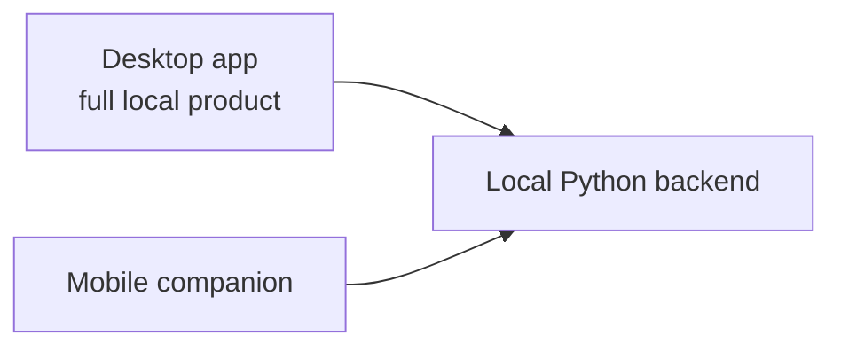

# Mobile Companion Strategy

Last updated: 2026-04-21
Status: Deferred follow-on; desktop backend contract is now in place

## Summary

The recommended product shape is:
1. full desktop app first
2. optional mobile companion later
3. no attempt to run the full assessment stack on the phone as the first move

This mirrors a credible pattern used by local-first creative tools:
1. desktop is the full local product
2. mobile is a companion for control, review, and lightweight input
3. mobile remains a non-blocking follow-on to the current desktop-baseline and
   hosted-migration work

## Product Decision

Mobile should be treated as a companion surface, not the primary runtime host.

This means:
1. the desktop app owns the local assessment runtime
2. the mobile app reuses the same backend contract when enabled
3. mobile should not depend on desktop UI exports or frontend-only conversion logic

## Why This Direction

### Good Fit

1. the current assessment engine is already Python-native
2. ASR, audio feature extraction, and scoring are better suited to desktop-class compute
3. local-first desktop packaging is already underway
4. mobile can add convenience without forcing an early runtime rewrite

### Bad Alternative

Do not do this first:
1. full local inference and scoring on iPhone or Android
2. frontend-derived backend logic
3. a public hosted backend product before the desktop and hosted product plan
   establishes the shared frontend and hosted storage/auth boundaries

Those paths would expand scope too early and blur the desktop-first direction.

## What Mobile Should Eventually Do

Good first companion responsibilities:
1. browse recent history
2. open full review/report details
3. trigger an assessment on a desktop-hosted backend
4. monitor assessment progress
5. upload a phone recording as assessment input

Possible later responsibilities:
1. browse sample prompts and examples
2. manage speaker profiles
3. lightweight notifications when an assessment finishes

Do not require mobile to:
1. run Whisper locally
2. compute the full report on device
3. own provider/model configuration as the first experience

## Required Backend Capabilities

The mobile companion should reuse the desktop backend contract, not a separate
mobile-only backend.

Required shared endpoints:
1. `GET /v1/diagnostics`
2. `GET /v1/runtime`
3. `POST /v1/uploads`
4. `POST /v1/assessments`
5. `GET /v1/assessments/{id}`
6. `GET /v1/history`
7. `GET /v1/history/{session_id}`
8. `GET /v1/samples`

Mobile-only additions, if needed later:
1. pairing/auth endpoints
2. optional sync endpoint
3. optional push-notification registration

## What To Avoid

Avoid the following trap:
1. desktop UI contains logic that mobile cannot call directly
2. mobile then needs a plugin or hack to reuse that UI logic
3. backend behavior becomes dependent on frontend code

Our rule should be:
1. business logic belongs in Python runtime or backend code
2. UI shells consume stable backend contracts
3. desktop and mobile should both be clients of the same core backend behavior

## Rollout Order

### Stage 1: Desktop Only

1. define and implement the local backend
2. keep it bound to `127.0.0.1`
3. ship a cleaner desktop-only product

Current state:
1. the local backend exists and is the only assessment execution path
2. the launcher starts or reuses it automatically
3. learner flows already consume backend-backed diagnostics, assessments,
   history detail, and sample browsing

### Stage 2: Optional LAN Companion

1. add opt-in LAN exposure
2. add pairing/auth
3. add explicit connection diagnostics

### Stage 3: Remote Companion, Only If Needed

1. define HTTPS story
2. add secure remote access flow
3. add background completion notifications

## Packaging Implications

Desktop remains the installable product for:
1. macOS as a first-class target
2. Windows as a first-class target
3. Linux on a no-regression basis

Mobile, if built later, should be framed as:
1. companion app
2. remote control and review surface
3. optional convenience layer

That preserves a clean business story too:
1. desktop app is the core value
2. mobile can later become an add-on, premium companion, or convenience layer
3. we do not need to commit to monetization mechanics now to keep the architecture ready

## Open Questions To Defer

1. whether the future mobile app should be Flutter, React Native, or native
2. whether desktop and mobile should share any non-API code
3. whether remote access should ever extend beyond LAN
4. whether mobile should support recording upload only, or also session setup and progress coaching
5. later in 2026, evaluate `cactus-compute/cactus` as an optional native/mobile or streaming transcription experiment now that it supports Whisper; do not treat it as the default desktop ASR replacement unless it can preserve the word-level timing contract and scoring quality we currently get from `faster-whisper`

## Immediate Rule For Future Mobile Work

If mobile starts later, it should:

1. consume the existing backend contract first
2. never depend on desktop UI exports or Streamlit-only logic
3. treat desktop as the primary installed product

Related planning doc:
1. `docs/DESKTOP_HOSTED_PRODUCT_PLAN.md` defines the approved desktop plus
   hosted migration path; mobile remains a later follow-on and should not block
   that work
