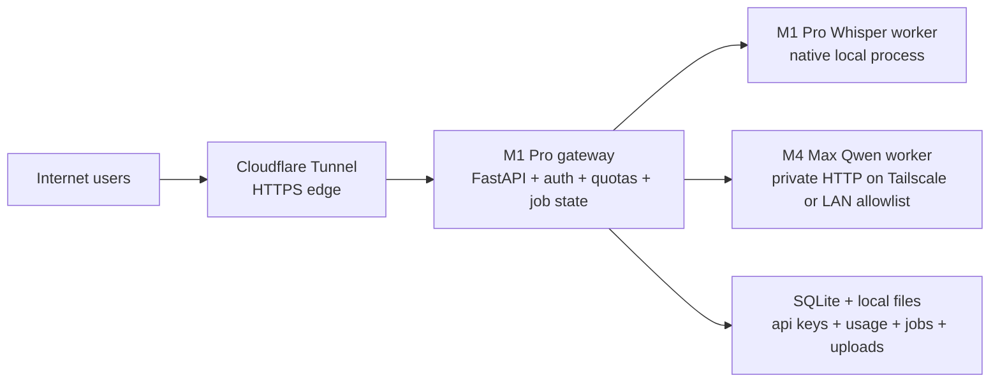

# Public Inference Architecture Plan

Last updated: 2026-04-21
Status: Exploratory rollout plan; not part of the current shipped desktop-first baseline

## Summary

If we want to expose local Whisper and Qwen-class inference to internet users
without taking on cloud GPU cost up front, the recommended shape is:
1. keep the current desktop-first product direction intact
2. add a small hosted edge on the `M1 Pro`
3. reserve the `M4 Max` for the heavier LLM worker
4. launch as an invite-only beta with strict quotas and queueing
5. expose one managed API, not raw model servers

Recommended machine split:
1. `M1 Pro 32 GB`: public ingress, auth, quotas, job state, uploads,
   transcription, admin
2. `M4 Max 128 GB`: private LLM worker for the primary Qwen model

## Product Decision

If we validate a hosted offering, the first public product should be a managed
API layer in front of the local machines, not direct public exposure of the
existing local backend and not direct public exposure of model runtimes.

This means:
1. the current local desktop backend remains the primary product architecture
2. hosted inference is treated as a separate beta service
3. the public edge owns auth, quotas, abuse controls, and degradation behavior
4. raw `llama.cpp`, `MLX-LM`, or `whisper.cpp` ports stay private
5. any `/v1/*` routes in this document live on that separate beta-service
   boundary and do not redefine the canonical product backend namespace used by
   the desktop baseline and approved hosted product plan

## Recommended Architecture

## Why This Split

### M1 Pro Responsibilities

The `M1 Pro` should be the edge box because it can safely own the slower,
smaller control-plane jobs:
1. terminate public traffic through `Cloudflare Tunnel`
2. validate API keys and enforce quotas
3. persist uploads, job state, logs, and audit records
4. run `Whisper` transcription for short and medium audio jobs
5. proxy or dispatch LLM requests to the `M4 Max`
6. serve a tiny admin UI or admin-only endpoints later

### M4 Max Responsibilities

The `M4 Max` should be reserved for the most expensive model work:
1. run the primary Qwen model
2. accept only private traffic from the `M1 Pro`
3. avoid public ingress, auth logic, and long-term storage
4. stay focused on one job: high-quality completion throughput

This keeps the most valuable machine available for inference instead of edge and
bookkeeping overhead.

## Runtime Recommendations

Recommended first-pass runtime choices:
1. LLM server on `M4 Max`: `llama.cpp` server as the default Qwen runtime
2. ASR server on `M1 Pro`: `whisper.cpp` server or a thin native wrapper around
   it
3. Gateway on `M1 Pro`: `FastAPI` with one small SQLite database
4. Process supervision on both Macs: native `launchd`, not Docker-first

Why avoid a Docker-first design on macOS:
1. Apple Silicon inference is strongest when Metal-native runtimes are allowed
   to stay close to the host
2. early-stage reliability matters more than container symmetry
3. `launchd` is simpler to keep alive on always-on Macs

## Model Policy

Start with a two-tier model policy:
1. primary LLM on `M4 Max`: one stronger Qwen3-class model for normal traffic
2. fallback LLM on `M1 Pro` or on the `M4 Max`: one smaller Qwen3-class model
   for degraded mode, admin access, or emergency failover

Do not start with a model matrix.

Keep it simple:
1. one primary general model
2. one fallback smaller model
3. one transcription model family

## Network Layout

Public ingress:
1. `Cloudflare Tunnel` on the `M1 Pro`
2. public DNS and HTTPS managed there
3. no inbound router port forwarding to either Mac

Private east-west traffic:
1. connect `M1 Pro` and `M4 Max` over `Tailscale` or a strict LAN allowlist
2. bind the Qwen worker to a private interface only
3. reject direct public access to the LLM worker

This is the low-cost safety baseline.

## API Shape

The public edge should expose a tiny stable contract:
1. `POST /v1/transcriptions`
2. `POST /v1/chat/completions`
3. `POST /v1/responses` only if we decide to mirror that style
4. `GET /v1/jobs/{id}` for queued long-running work
5. `GET /v1/health`

These routes belong to the exploratory hosted inference service only. They are
not additions to the current product backend contract centered on
`/v1/health`, `/v1/diagnostics`, `/v1/runtime`, `/v1/uploads`,
`/v1/assessments`, `/v1/history`, and `/v1/samples`.

Recommended request policy:
1. synchronous for short text completions
2. synchronous for short transcription
3. queued jobs for long audio and expensive multi-step tasks

Do not expose:
1. direct `whisper.cpp` endpoints
2. direct `llama.cpp` endpoints
3. debug or model-admin endpoints

## Data Flow

### Transcription Request

1. user uploads audio to the gateway on `M1 Pro`
2. gateway validates key, file size, duration limit, and quota
3. gateway stores the upload locally with a short retention period
4. `M1 Pro` Whisper worker transcribes it
5. gateway returns transcript and metadata
6. audio is deleted after the retention window unless the user explicitly
   requests persistence later

### LLM Request

1. user sends prompt to the gateway on `M1 Pro`
2. gateway validates key, context budget, and rate limits
3. gateway forwards the normalized request to the private Qwen worker on the
   `M4 Max`
4. gateway streams or returns the result
5. gateway records token usage and latency in SQLite

### Combined Pipeline

For workflows that need both audio and LLM work:
1. upload and transcription happen on `M1 Pro`
2. only transcript text and small metadata are sent to the `M4 Max`
3. results are merged by the gateway

This avoids moving large audio blobs between machines unnecessarily.

## Persistence

Do not start with a distributed queue or a separate database cluster.

Initial persistence should be:
1. SQLite for users, API keys, quotas, usage counters, and job state
2. local disk on `M1 Pro` for temporary uploads and logs
3. structured JSON logs rotated locally

This is enough for:
1. invite-only beta users
2. manual support and debugging
3. simple export of usage data when pricing is introduced later

## Abuse And Cost Controls

Because we may not get paid initially, the architecture must be intentionally
defensive.

Required controls from day one:
1. invite-only API keys
2. daily and monthly quota caps per key
3. per-request limits on audio size, duration, prompt size, and output tokens
4. hard concurrency caps per service
5. queue depth limits with fast `429` or `503` responses when saturated
6. short retention windows for uploaded audio and generated artifacts
7. admin-only model selection

Recommended first limits:
1. one heavy LLM job at a time on the `M4 Max`
2. one or two concurrent Whisper jobs on the `M1 Pro`
3. short maximum audio duration for the first beta
4. no anonymous access

## Security Baseline

Do this before public beta:
1. require API keys for every non-health endpoint
2. hash stored API keys instead of storing raw secrets
3. add basic request signing or an internal shared secret between gateway and
   worker
4. allowlist the worker so only the `M1 Pro` can reach it
5. add audit logs for admin actions
6. redact prompts and transcripts from logs by default where practical

Do not do this:
1. expose the worker directly
2. open inbound ports on the router if `Cloudflare Tunnel` can avoid it
3. keep audio forever by default

## Reliability And Degraded Mode

The beta should fail small and clearly.

Degraded-mode rules:
1. if the `M4 Max` is unavailable, either reject heavy LLM work cleanly or
   route only approved low-tier traffic to a smaller fallback model
2. if Whisper is overloaded, queue audio jobs instead of timing out silently
3. if the SQLite database is unhealthy, stop accepting new jobs instead of
   pretending requests succeeded
4. surface queue position and expected retry behavior explicitly

## Operations

Use native macOS service management:
1. one `launchd` service for the gateway on the `M1 Pro`
2. one `launchd` service for Whisper on the `M1 Pro`
3. one `launchd` service for Qwen on the `M4 Max`

Minimum observability:
1. per-endpoint request count
2. per-key usage counters
3. median and p95 latency
4. queue depth
5. worker alive status
6. disk usage for uploads and logs

## Rollout Plan

### Stage 0: Private Alpha

1. keep access limited to us and a few trusted testers
2. run the gateway only on `M1 Pro`
3. run one primary Qwen worker on `M4 Max`
4. collect usage, latency, failure, and saturation data
5. tune hard limits before any public link is shared

### Stage 1: Invite-Only Beta

1. issue manual API keys to a small allowlist
2. document limits clearly
3. keep concurrency low and queue aggressively
4. support only one public endpoint family at first if needed
5. do not build self-serve billing yet

### Stage 2: Paid Pilot

Only move here if real demand exists.

Add:
1. simple credit accounting
2. clearer usage dashboards
3. one billing path
4. retention and privacy controls that can be explained to customers

### Stage 3: Re-Architecture Trigger

Revisit the architecture when one of these becomes true:
1. the Macs are saturated during normal usage
2. uptime expectations exceed what home-hosted hardware can comfortably meet
3. support burden from manual key management becomes too high
4. we need regional latency, redundancy, or contractual SLAs

At that point:
1. keep the gateway contract stable
2. move workers or storage to cloud incrementally
3. avoid rewriting client integrations

## What Not To Build Yet

Do not start with:
1. Kubernetes
2. Redis plus Celery plus Postgres if SQLite is still sufficient
3. self-serve signup
4. multi-region failover
5. automated billing before users prove they need the service
6. a full web app if an API beta is enough to validate demand

## Recommended First Build Order

1. create the `M1 Pro` gateway with auth, quota checks, and SQLite-backed usage
2. wire in local Whisper on the `M1 Pro`
3. wire in private Qwen inference on the `M4 Max`
4. add queueing and explicit job-state endpoints
5. add retention cleanup and admin reporting
6. test degraded-mode behavior before inviting external users

## Relation To Existing Repo Direction

This plan should not replace the current local-first product direction.

It should be treated as:
1. a separate hosted beta path
2. a way to validate demand before cloud spend
3. an architecture that borrows from the current backend discipline but does
   not force the desktop product to become a hosted service immediately

Related planning docs:
1. `docs/LOCAL_BACKEND_ARCHITECTURE.md`
2. `docs/MOBILE_COMPANION_STRATEGY.md`
3. `docs/IMPLEMENTATION_PLAN.md`
