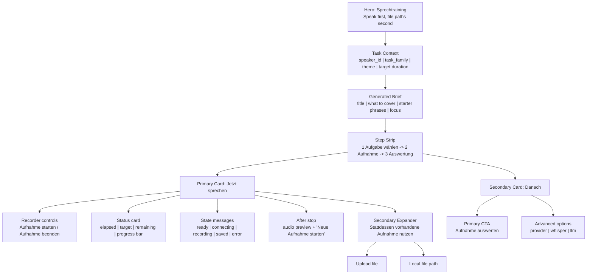

# Recorder UX Wireframe

## Goal

The learner should understand three things immediately:

1. what to talk about,
2. whether recording is currently running,
3. what happens after pressing stop.

Uploads remain available, but as a secondary fallback.

## Main Practice Screen

## Recorder States

### 1. Ready

- Message: recording is not running yet.
- Primary instruction: click `Aufnahme starten`.
- The evaluation CTA stays disabled.

### 2. Connecting

- Message: microphone connection is being established.
- If this takes too long, surface a user-visible failure.
- Fallback guidance: check browser mic permission or use upload.

### 3. Recording

- Show:
  - elapsed time,
  - target time,
  - remaining time,
  - progress bar.
- Message: recording is live, stop in the recorder when finished.

### 4. Saved

- Message: audio was saved successfully.
- Show:
  - short preview player,
  - next-step copy,
  - `Neue Aufnahme starten`,
  - enabled `Aufnahme auswerten`.

### 5. Error

- Show a visible learner-facing error instead of only terminal logs.
- Example:
  - microphone connection failed,
  - no audio captured,
  - save failed.

## Prompt Trainer

The prompt trainer should follow the same lifecycle:

1. `Übung starten`
2. listen to the prompt if needed
3. record answer
4. answer is auto-saved after stop
5. `Antwort auswerten`
6. optional upload only inside an expander

## UX Decisions

1. Browser recording is the primary path.
2. Upload/path usage is secondary and explicitly labeled as such.
3. The user never has to guess whether recording is live.
4. The user sees what happens after stop.
5. Terminal-only recorder failures are treated as UI failures and need visible status/error copy.
